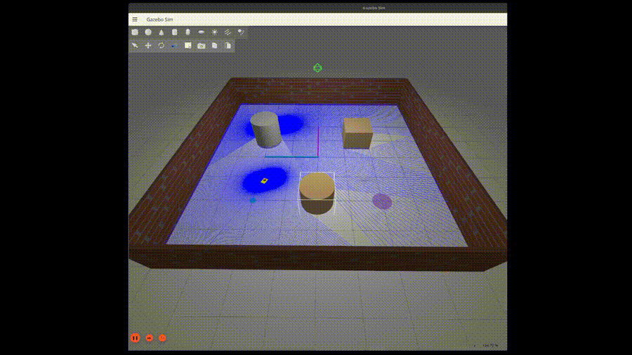
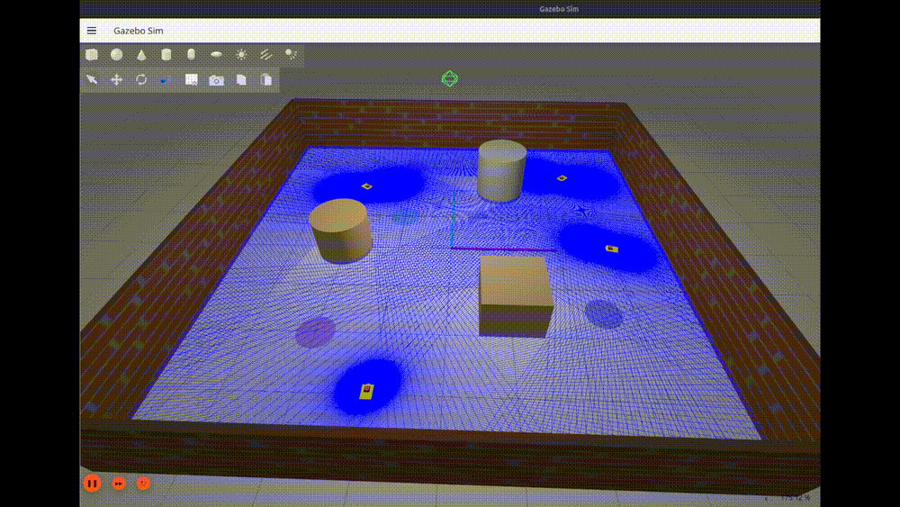
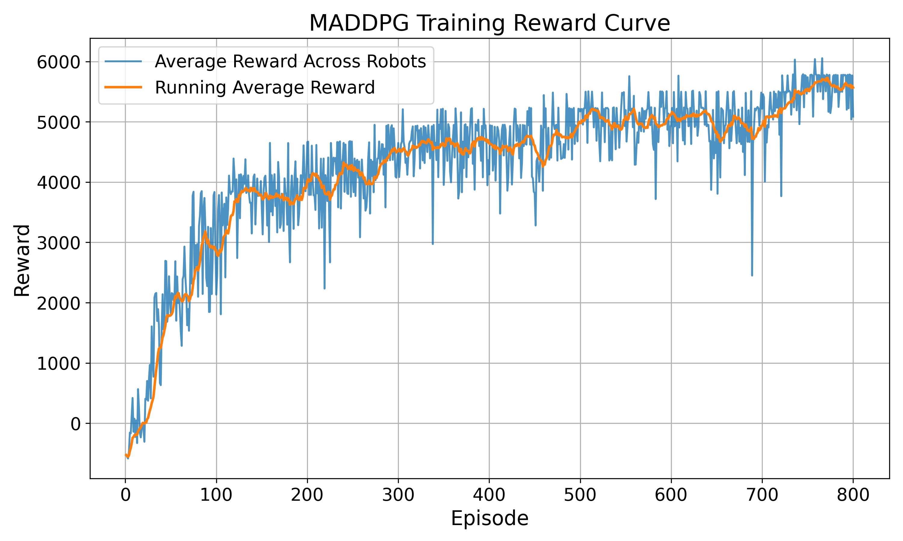
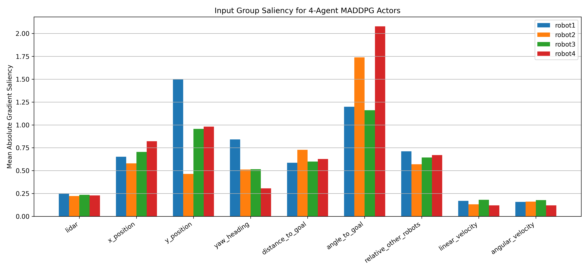

# Multi-Agent Reinforcement Learning for Differential-Drive Robot Navigation in ROS 2 and Gazebo

## Overview

This project develops a deep reinforcement learning framework for autonomous navigation of multiple differential-drive robots in a ROS 2/Gazebo-based multi-agent simulation environment. The main task is to train multiple EduBot differential-drive robots to navigate toward their assigned goals while avoiding static obstacles, arena walls, and collisions with each other. The main method used in the Gazebo environment is **MADDPG** under a **Centralized Training with Decentralized Execution (CTDE)** framework. During training, each critic uses global multi-agent information, while during execution each robot selects actions using only its own local observation.

This repository is organized as an evolving reinforcement learning capstone project. Version 1 focuses on MDP formulation and Dynamic Programming. Version 2 extends the project to model-free reinforcement learning, replay buffers, neural networks, and multi-agent deep reinforcement learning in Gazebo. Version 3 further scales the MADDPG framework from two robots to four robots and introduces saliency-based policy interpretation for multi-agent navigation. 

---

## Demo and Training Results

The following demos show the trained MADDPG policies running in the ROS 2/Gazebo environment. The EduBot differential-drive robots navigate in the Gazebo arena using the trained actor policies while avoiding obstacles and other robots.

### Two-Robot Demo



### Four-Robot Demo



---

## Training Reward Curve

The training reward curve is shown below. The plot includes the reward trends for the robots and the average reward during MADDPG training.



---

## Saliency Analysis

The saliency analysis result is shown below. The plot illustrates which input feature groups had the strongest influence on the trained actor policies.



---

## Project Goals

The goals of this project are to:

- Formulate robot navigation as a reinforcement learning problem
- Implement Dynamic Programming methods on a simplified GridWorld task
- Build a ROS 2/Gazebo simulation environment for differential-drive robots
- Train multi-agent policies for continuous robot control
- Use LiDAR-based observations for obstacle avoidance
- Apply MADDPG using a CTDE training framework
- Organize training logs, plots, checkpoints, and technical challenges
- Develop a portfolio-style reinforcement learning repository

---

## Version 1 Scope

Version 1 focused on the foundational reinforcement learning setup:

- Markov Decision Process formulation
- GridWorld abstraction
- Dynamic Programming
  - Value Iteration
  - Policy Iteration
- Basic agent framework
- Value-function visualization
- Policy visualization

The simplified GridWorld environment was used to verify the MDP formulation before scaling the project to ROS 2 and Gazebo.

---

## Version 2 Scope

Version 2 extends the project from Dynamic Programming to model-free reinforcement learning and deep multi-agent reinforcement learning.

The main additions in Version 2 are:

- ROS 2/Gazebo multi-agent simulation
- Two EduBot differential-drive robots
- 2D LiDAR-based perception
- Continuous action space
- Multi-agent replay buffer
- Actor-Critic neural networks
- MADDPG training framework
- Centralized Training with Decentralized Execution
- Training logs and reward plots
- Model checkpoint organization
- Technical challenge documentation

---

## Version 3 Scope

Version 3 extends the Version 2 MADDPG framework from two robots to a four-agent reinforcement learning system in ROS 2/Gazebo.

The main additions in Version 3 are:

- Expanded the environment from two EduBot robots to four independent agents.
- Generalized the MADDPG training, replay buffer, testing, and reward logging for four robots.
- Updated start/goal positions, robot-robot collision handling, and Gazebo global pose tracking.
- Tuned the reward function and training hyperparameters to improve goal-directed navigation.
- Added gradient-based saliency analysis to interpret which state features influence the trained policies.

The main focus of Version 3 is to evaluate whether the MADDPG-based multi-agent reinforcement learning framework can scale from two robots to four robots while maintaining centralized training and decentralized execution.

The main deep reinforcement learning algorithm implemented is:

**MADDPG: Multi-Agent Deep Deterministic Policy Gradient**

---

## Repository Structure

```text
RL-ROBUST-NAVIGATION/
│
├── README.md
├── requirements.txt
├── technical-challenges.md
│
├── results/
│   ├── grid_world/
│   │   ├── value_iteration_value.png
│   │   ├── value_iteration_policy.png
│   │   ├── policy_iteration_value.png
│   │   └── policy_iteration_policy.png
│   │
│   └── gazebo_maddpg/
│       ├── training_logs/
│       │   └── training_log.csv
│       ├── training_plots/
│       │   └── training_curve.png
│       └── saved_models/
│
├── src/
│   ├── agents/
│   │   ├── __init__.py
│   │   └── dp_agent.py
        └── maddpg_agent.py
│   │
│   ├── environments/
│   │   ├── __init__.py
│   │   ├── grid_world.py
│   │   └── multiagent_gazebo_env.py
│   │
│   └── algorithms/
│       ├── __init__.py
│       │
│       ├── dynamic_programming/
│       │   ├── __init__.py
│       │   └── run_dp.py
│       │
│       └── deep_rl/
│           ├── __init__.py
│           ├── networks.py
│           ├── replay_buffer.py
│           ├── train_maddpg.py
│           ├── test_policy.py
│           ├── saliency_test.py
│
└── ros2_ws/
    └── src/
        └── edubot_sim/
            ├── package.xml
            ├── setup.py
            ├── setup.cfg
            ├── resource/
            │   └── edubot_sim
            ├── edubot_sim/
            │   └── __init__.py
            ├── launch/
            │   └── edubot_launch.py
            ├── urdf/
            │   └── edubot.urdf.xacro
            ├── worlds/
            │   └── training_arena.sdf
            └── media/
```

---

## Simulation Environment

The main simulation environment is built using **ROS 2 and Gazebo**.

### Robot Platform

The project uses multiple EduBot differential-drive robots. Each robot has:

- Differential-drive motion
- 2D LiDAR sensor
- Gazebo pose tracking
- Continuous velocity control

Each robot receives a continuous action:

```text
action = [linear_velocity, angular_velocity]
```

The linear velocity controls forward motion, while the angular velocity controls turning.

---

## Gazebo World

The Gazebo world includes:

- A bounded arena
- Static walls
- Cylindrical obstacles
- Box obstacles
- Start markers
- Goal markers
- Multiple EduBot robots

The environment is designed so that both robots must reach their own goals while avoiding obstacles and avoiding each other.

---

## Markov Decision Process Formulation

The navigation task is formulated as a Markov Decision Process:

```text
M = (S, A, P, R, gamma)
```

where:

- `S` is the state or observation space
- `A` is the action space
- `P` is the transition function
- `R` is the reward function
- `gamma` is the discount factor

In the Gazebo environment, the agent does not know the transition function analytically. Instead, it learns from interaction data collected during simulation.

Because the task contains multiple robots, the environment is also non-stationary from the perspective of each individual robot. The action of one robot can change the next state and reward of the other robot. This motivates the use of a multi-agent actor-critic method.

---

## Observation Space

Each robot receives a local observation containing:

- Downsampled LiDAR scan
- Robot global position
- Robot yaw angle
- Distance to the goal
- Angle to the goal
- Relative position of the other robot
- Current linear velocity
- Current angular velocity

The local observation is used by each actor network to select an action.

For critic training, the global state is formed by concatenating the observations of both robots.

---

## Action Space

In the Gazebo environment, the action space is continuous:

```text
linear velocity  in [0, max_linear]
angular velocity in [-max_angular, max_angular]
```

This makes the Gazebo task more realistic and suitable for actor-critic deep reinforcement learning.

---
## Reward Function

The reward function encourages each robot to move toward its assigned goal while avoiding obstacles, walls, and other robots.

For robot \(i\), the distance to the goal is:

$$
d_i(t)=\|\mathbf{p}_i(t)-\mathbf{g}_i\|_2
$$

The progress toward the goal is:

$$
\Delta d_i(t)=d_i(t-1)-d_i(t)
$$

The reward used in the Gazebo environment is:

$$
r_i(t)=
-0.01
+10\Delta d_i(t)
-0.05d_i(t)
-0.2I_{\text{near}}
-0.05I_{\text{idle}}
+1000I_{\text{goal}}
-100I_{\text{collision}}
-50I_{\text{max}}
$$

where:

- `I_near = 1` if the robot is close to an obstacle, otherwise `0`
- `I_idle = 1` if the robot is almost stopped, otherwise `0`
- `I_goal = 1` if the robot reaches its goal, otherwise `0`
- `I_collision = 1` if the robot collides with an obstacle or another robot, otherwise `0`
- `I_max = 1` if the maximum step limit is reached, otherwise `0`

This reward gives a positive value for moving closer to the goal and reaching the goal, while penalizing collisions, idling, and inefficient paths.

## Method: MADDPG with CTDE

The main method in this project is **Multi-Agent Deep Deterministic Policy Gradient (MADDPG)**.

MADDPG is an actor-critic method for multi-agent continuous-control problems. In this project, each robot has its own actor and critic network. The implementation follows **Centralized Training with Decentralized Execution (CTDE)**.

For robot $i$, the actor selects a continuous action from its local observation:

$$a_i = \mu_i(o_i)$$

where $o_i$ is the local observation and $a_i = [v_i, \omega_i]$ contains the linear and angular velocity commands.

For $N$ robots, the centralized state and joint action are:

$$s = [o_1, o_2, \dots, o_N]$$

$$a = [a_1, a_2, \dots, a_N]$$

### Centralized Training

During training, each critic receives the global state and joint actions:

```text
critic_input = global_state + joint_actions
```

The critic for robot $i$ estimates:

$$Q_i(s, a_1, a_2, \dots, a_N)$$

The target value used to train the critic is:

$$y_i = r_i + \gamma(1-d_i)Q_i^{target}(s', a_1', a_2', \dots, a_N')$$

where $r_i$ is the reward, $\gamma$ is the discount factor, $d_i$ is the done flag, and the next actions are produced by the target actors:

$$a_j' = \mu_j^{target}(o_j')$$

The critic loss is:

$$L_i = \frac{1}{B}\sum_{b=1}^{B}\left(Q_i(s^b, a_1^b, \dots, a_N^b) - y_i^b\right)^2$$

The actor is updated by maximizing the critic value. In the implementation, this is done by minimizing the negative critic value:

$$L_{\mu_i} = -\frac{1}{B}\sum_{b=1}^{B}Q_i(s^b, a_1^b, \dots, \mu_i(o_i^b), \dots, a_N^b)$$

The target networks are updated using soft updates:

$$\theta^{target} \leftarrow \tau\theta + (1-\tau)\theta^{target}$$

### Decentralized Execution

During execution, each actor uses only its own robot's local observation:

```text
actor_input = local_observation
```

Each robot independently selects its action:

$$a_i = \mu_i(o_i)$$

This means that after training, each robot can act without access to the full global state or the other robots' complete observations.

### CTDE Summary

In this project:

- Each robot has its own actor network.
- Each robot has its own critic network.
- The actor uses only local observations.
- The critic uses the global state and joint actions during training.
- The replay buffer stores multi-agent experience.
- Policies can be executed independently after training.

This CTDE structure is suitable for the Gazebo navigation task because robots interact during learning, but each robot should operate independently during deployment.

---

## Implemented Algorithms

The main deep reinforcement learning algorithm implemented is:

**MADDPG: Multi-Agent Deep Deterministic Policy Gradient**

MADDPG is used because this project involves:

- Multiple agents
- Continuous actions
- Partial observations
- Interaction between agents
- Non-stationary learning from each agent's perspective
- The need for centralized training and decentralized execution

Each robot has its own actor network. The actor receives the robot's local observation and outputs a continuous action.

During training, each robot also has a critic network. The critic receives the global state and joint actions of both robots. This follows the CTDE framework.

---

## Why MADDPG?

MADDPG is suitable for this project because the Gazebo navigation task is a continuous-control multi-agent problem.

Comparison with other algorithms:

- Q-learning is useful for discrete state-action spaces but does not scale well to continuous Gazebo observations.
- SARSA and Monte Carlo methods are useful for classical RL but are not ideal for high-dimensional LiDAR-based robot control.
- DQN is mainly designed for discrete action spaces.
- REINFORCE can suffer from high variance in long-horizon navigation tasks.
- Vanilla actor-critic can handle continuous actions but does not directly address multi-agent non-stationarity.
- PPO and SAC are strong alternatives, but MADDPG directly supports multi-agent continuous-control learning using CTDE.
- TD3 could improve stability, but MADDPG is a direct first choice for multi-agent actor-critic navigation.

Therefore, MADDPG is selected as the main deep reinforcement learning method for the Gazebo-based two-robot navigation task.

---

## Neural Network Architecture

The project uses actor-critic neural networks.

### Actor Network

The actor network receives a robot's local observation and outputs:

linear_velocity
angular_velocity

Each robot maintains:

- Actor network
- Target actor network
- Critic network
- Target critic network

Target networks are updated using soft updates to improve training stability.

---

## Replay Buffer

The multi-agent replay buffer stores:

- Robot 1 observation
- Robot 2 observation
- Global state
- Joint action
- Reward for each robot
- Next Robot 1 observation
- Next Robot 2 observation
- Next global state
- Done flags

The replay buffer allows off-policy training using mini-batches of previous experience.

The replay buffer is also important for CTDE because it stores the information required for centralized critic updates.

---

## Training Process

The training process follows these steps:

1. Reset both robots in the Gazebo environment.
2. Get local observations for both robots.
3. Each actor selects an action using its own local observation.
4. The joint action is applied to the Gazebo environment.
5. The environment returns next observations, rewards, and done flags.
6. The transition is stored in the replay buffer.
7. A mini-batch is sampled from the replay buffer.
8. Each critic is updated using the global state and joint actions.
9. Each actor is updated using the policy gradient from its critic.
10. Target actor and critic networks are softly updated.
11. Training logs and model checkpoints are saved.

---

## Training Outputs

Training outputs are saved in the `results/` directory.

```text
results/
└── gazebo_maddpg/
    ├── training_logs/
    │   └── training_log.csv
    ├── training_plots/
    │   └── training_curve.png
    └── saved_models/
```

The training log contains:

```text
episode
reward_robot1
reward_robot2
avg_reward
```

The training plot shows the reward trend over episodes.

---

## Installation

### Python Dependencies

Install Python dependencies using:

```bash
pip install -r requirements.txt
```

Example dependencies include:

```text
numpy
torch
matplotlib
pandas
```

### ROS 2 and Gazebo Dependencies

This project also requires:

- ROS 2
- Gazebo
- `ros_gz_sim`
- `ros_gz_bridge`
- `robot_state_publisher`
- `xacro`

These packages should be installed through the ROS 2 package manager.

---

## How to Run Dynamic Programming

From the repository root, run Value Iteration:

```bash
python3 -m src.algorithms.dynamic_programming.run_dp --algo value_iteration
```

Run Policy Iteration:

```bash
python3 -m src.algorithms.dynamic_programming.run_dp --algo policy_iteration
```
---

## How to Build the ROS 2 Workspace

From the repository root:

```bash
cd ros2_ws
colcon build
source install/setup.bash
```

---

## How to Launch the Gazebo Environment

After building and sourcing the ROS 2 workspace:

```bash
ros2 launch edubot_sim edubot_launch.py
```

This launches the Gazebo world and spawns the multiple EduBot robots.

---

## How to Train MADDPG

Open a second terminal from the repository root and run:

```bash
python3 -m src.algorithms.deep_rl.train_maddpg
```

The training script will:

- Initialize the multi-agent Gazebo environment
- Create multiple MADDPG agents
- Store transitions in the replay buffer
- Update actor and critic networks using CTDE
- Save training logs
- Save model checkpoints
- Generate reward plots

---

## Technical Challenges

Major technical challenges encountered during development include:

- Connecting ROS 2 topics with Gazebo topics
- Bridging velocity, LiDAR, odometry, and pose topics
- Reading reliable global robot poses from Gazebo
- Handling LiDAR `inf` and `nan` values
- Designing reset logic for one robot versus both robots
- Handling robot-robot collision termination
- Stabilizing actor-critic training
- Structuring the CTDE training process
- Selecting useful reward shaping terms

More details are documented in:

```text
technical-challenges.md
```

---

## Current Status

The current project includes:

- GridWorld environment
- Value Iteration
- Policy Iteration
- ROS 2/Gazebo EduBot simulation
- Two-agent navigation environment
- LiDAR-based observations
- Continuous velocity actions
- Multi-agent replay buffer
- Actor-Critic neural networks
- MADDPG training script
- CTDE-based centralized critic training
- Decentralized actor execution
- Training logs
- Reward plots
- Model checkpoint saving

---

## Future Work

Future improvements may include:
- Adding randomized start and goal positions
- Adding domain randomization
- Testing sim-to-real transfer on physical robots

---

## Acknowledgments

The project uses ROS 2, Gazebo, PyTorch, NumPy, and Matplotlib for simulation, learning, numerical computation, and visualization.

ChatGPT was used for code organization, README drafting, debugging guidance, and repository-structure planning.

---
